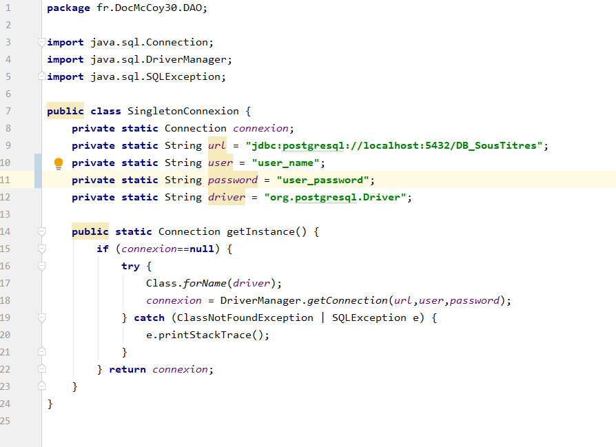

### **Configuration**

- Run Configuration :

- artifact : 

 

- lib : 

- DataBase :
Les dump de la base de données sont disponibles dans le dossier ".DataBase" :
1- structure.sql => création des tables
2- data.sql => insertion des données dans la table "langues" (3 langues disponibles par défaut)

- DB Driver : 
La configuration de la connection à la base de données est définie dans la classe "SingletonConnexion" :
modifier les attributs "user" et "password" 

- Dossier cible :
Les fichiers (temp et .srt) sont enregistrés dans un repertoire cible dont le chemin figure dans "resources/chemin_fichier.properties"
Il est nécessaire de créer ce dossier avant d'importer un fichier.

### **Editeur de sous-titres :**
- Accueil :
    - Dans la page d'accueil, cliquer sur "Editeur de sous-titres".
    
- Gestion des fichiers :
    - Choisir le fichier .srt à importer, lui donner un titre, définir une langue et cliquer sur "upload".
Le fichier est importé dans le dossier cible C:/OCSousTitres/fichiers.
    - "supprimer" efface le fichier dans le système et la base de données.
    - "modifier" permet de modifier le nom et la langue dans la base de données.
    - "éditer" permet d'éditer les sous-titres.
    
- Edition :
    - l'édition des sous-titres s'effectue dans les inputs à droite des sous-titres originaux.
    - "enregistrer" enregistre les sous-titres édités dans la base de données.
    - "exporter" permet d'écrire les sous-titres édités et enregistrés dans un fichier .srt dans le dossier cible C:/OCSousTitres/fichiers.
    renseigner un titre et une langue et cliquer sur "exporter".
    **! les modifications doivent etre enregistrées avant d'etre exportées !**
    - "home" permet de revenir à la page de gestion des fichiers.

 